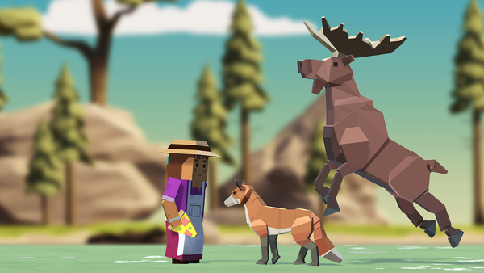

# Overview

In this lesson we'll take a step back and look over the code for [Prototype 2][lesson[ - the code is has a few bugs and we'll work on fixing them collaboratively using GitHub's **issues** feature.

<!-- Don't edit links here, change them in _data/assignment.yml instead, -->

[lesson]: <{{site.data.assignment.lesson}}>     
[slides]:   <{{site.data.assignment.slides}}>   
[template]: <{{site.data.assignment.template}}> 
